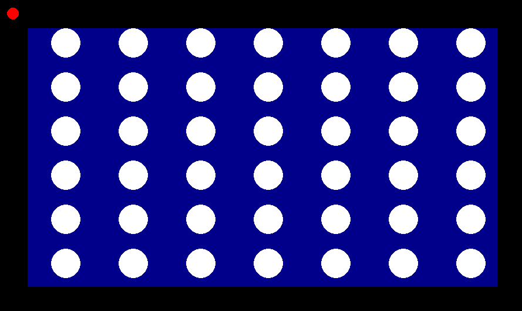
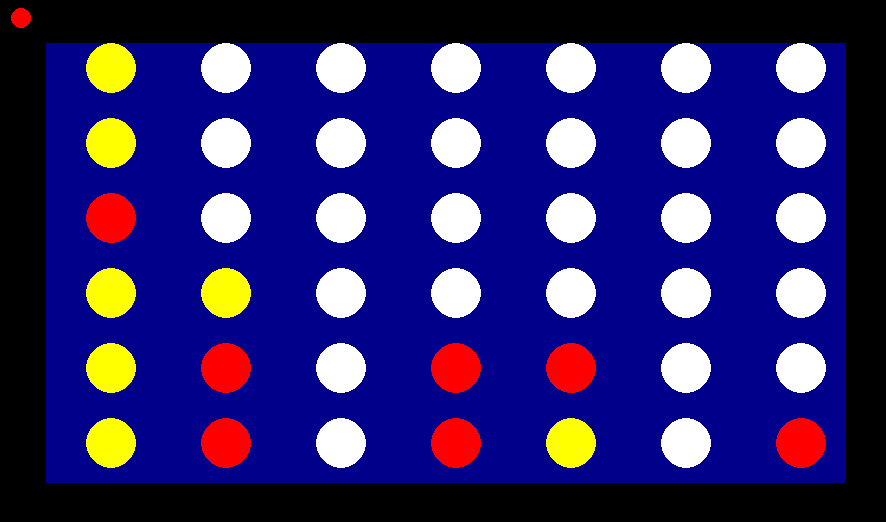
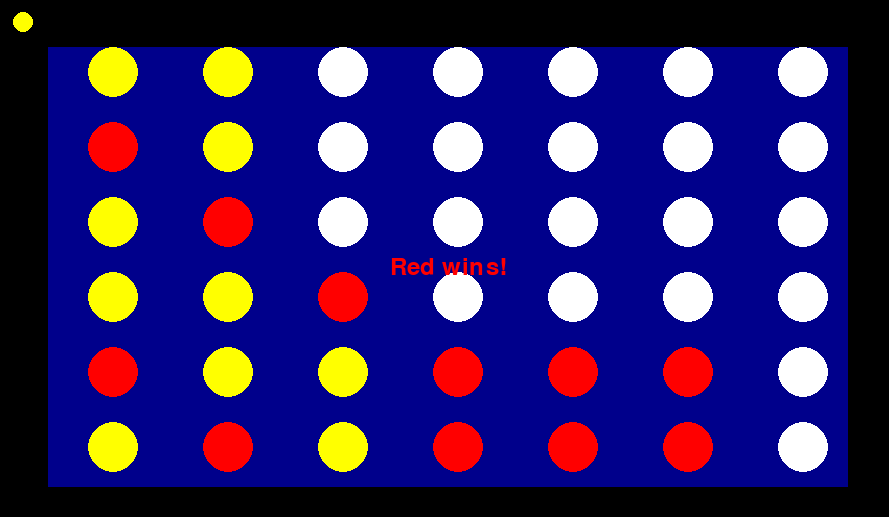

# Connect Four Game

This project is a **Connect Four game** implemented in Python using **Pygame**. It features a graphical interface, AI opponent, and support for two players (human vs. AI).

## Features

- **Graphical Interface**: A colorful game board rendered using Pygame.
- **AI Opponent**: A computer-controlled player powered by the Minimax algorithm with adjustable depth.
- **Interactive Gameplay**: Players take turns dropping pieces into columns to connect four in a row.
- **Win Detection**: Horizontal, vertical, and diagonal wins are detected automatically.
- **Dynamic Turn Display**: Visual indicator showing which player’s turn it is.
- **Endgame Display**: Displays the winner or a draw message when the game ends.

---

## How to Run

1. **Prerequisites**:
   - Python 3.9 or above
   - Pygame library installed (`pip install pygame`)
   - Numpy and Scipy libraries (`pip install numpy scipy`)

2. **Clone or Download**:
   Clone the repository or download the source files.

3. **Run the Game**:
   Execute the following command:
   ```bash
   python main.py


4. **Gameplay Instructions**

- The goal is to connect **four pieces in a row**, either horizontally, vertically, or diagonally.
- The **Red** player starts the game.
- The **Yellow** player is controlled by the AI.
- Click on a column to drop your piece.
- The game ends when:
  - A player connects four pieces.
  - The board is full (resulting in a draw).

## Screenshots

### **Start of Game**


### **During Game**


### **Winning Screen**

